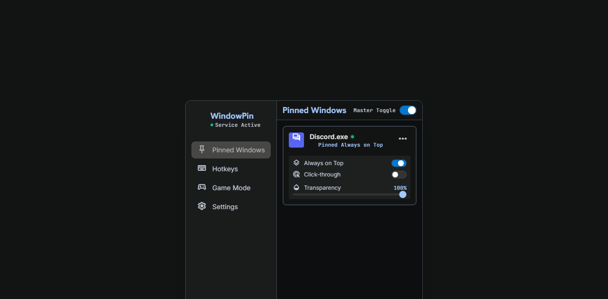

<div align="center">
  
  <h1>Pintra</h1>
  <p>Менеджер оконных оверлеев для Windows.</p>

  [](https://github.com/IcEe-lab-cmy/Pintra/releases/latest)
  [](https://github.com/IcEe-lab-cmy/Pintra/releases/latest)
</div>



## Скачать

Готовая версия доступна на странице [Releases](https://github.com/IcEe-lab-cmy/Pintra/releases/latest).

1. Скачайте `Pintra-Setup-1.0.0-win-x64.exe`.
2. Запустите установщик и выберите папку установки.
3. При необходимости включите ярлык на рабочем столе и автозапуск.

Установщик добавляет Pintra в меню «Пуск» и создаёт штатный деинсталлятор. Приложение самодостаточное и не требует отдельной установки .NET. Для интерфейса необходим Microsoft Edge WebView2 Runtime, который обычно уже установлен в Windows 10 и 11.

## Возможности

- Закрепление окон поверх остальных.
- Пропуск кликов и аварийное восстановление управления.
- Настраиваемые глобальные горячие клавиши.
- Профили приложений со своими сочетаниями клавиш.
- Прозрачность, расположение и блокировка позиции окна.
- Игровой режим, системный трей, русский и английский языки.
- Звуковое подтверждение и подсветка выбранного окна.
- Автоматическая диагностика при запуске.

## Проверка файла

SHA-256 для `Pintra-Setup-1.0.0-win-x64.exe`:

```text
DB0F5892BC98B2AEEFAB6923B8E79E3C20F054EC0E54766E9F8DCC8B1B719DD1
```

Публичный репозиторий содержит только страницу продукта и готовые Release-сборки. Исходный код здесь не публикуется.

## Автор

Создатель Pintra — **ICE**.
